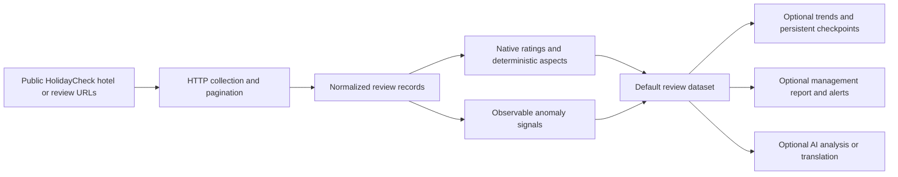

**Live Actor and maintained API: [Run HolidayCheck Review Intelligence on Apify](https://apify.com/kamerozkan/holidaycheck-review-intelligence)**

# HolidayCheck Reviews Scraper & German Hotel Reports: Samples

Collect HolidayCheck guest reviews and create German or English hotel reputation reports for management and agencies. Export ratings and aspect evidence, compare nearby competitors and monitor review changes. Start with a ready-to-run 20-review report. Independent tool; no HolidayCheck login.

[Run HolidayCheck Reviews Scraper & German Hotel Reports on Apify](https://apify.com/kamerozkan/holidaycheck-review-intelligence)

[](https://apify.com/kamerozkan/holidaycheck-review-intelligence)
[](dataset_record.schema.json)
[](#source-boundaries)
[](LICENSE)

German-language hotel review data for DACH reputation, operations, and agency workflows. The Actor turns publicly available HolidayCheck review pages into structured ratings, source-reported verified-stay flags, deterministic aspect scores, observable anomaly signals, and optional management reports.

This is an unofficial, independent Actor. It is not affiliated with, endorsed by, or supported by HolidayCheck.

## Current verification

On September 30, 2026, the German management-report and competitor-benchmark inputs each completed on build `0.4.16`, returning 20 unique reviews with nonempty text and healthy collection status. Both generated German reports in JSON, HTML and plain text. The competitor example returned one set with five candidates; live prices and AI were disabled.

Release `0.4.17` changes only the Store README, retaining the same contracts. The German report input was checked again on this release: 20 unique reviews with nonempty text, healthy collection and a generated German report. See [release-verification.json](release-verification.json) and [verification-2026-09-30.json](verification-2026-09-30.json). These are owner tests of capped samples, not customer evidence, full hotel histories or proof that every optional feature works for every hotel. Trends from a new capped sample do not establish long-term changes.

The redacted review outputs below retain their original July 28 provenance from run `KHUAJkF5fVUqKtd75`, build `0.4.10`, dataset `9r8R4Ivo0xSeIrM75`. They have not been relabeled as September observations. [dataset_record.schema.json](dataset_record.schema.json) and [input.schema.json](input.schema.json) were refreshed from deployed source `0.4.16`.

## Build a client report for a hotel portfolio

[Start the capped two-hotel Task](https://apify.com/kamerozkan/holidaycheck-review-intelligence/examples/create-a-two-hotel-review-portfolio-report), then export its data for the local builder below. The README-only release `0.4.18` produced 40 unique reviews across two hotels, with healthy collection and one delivered German management report. [Release evidence](workflow-release-2026-09-30.json). This is an owner test, not customer revenue.

The local [Python report builder](build_client_report.py) combines exported Actor datasets, `OUTPUT` records and optional `MANAGEMENT_REPORT` JSON records into one readable HTML briefing and a separate client-report JSON contract. It uses Python 3.9 or later with the standard library, reads local files and makes no network requests. It does not start an Actor or incur platform or AI charges. Both files are published together into a new output directory; an existing destination is refused, preserving earlier reports.

[Open the dated two-hotel HTML sample](client-report-sample/report.html) or inspect its [client-report JSON](client-report-sample/report.json) and [manifest](client-report-sample/manifest.json).

The sample contains **two distinct hotels and 40 identified unique reviews**, 20 per hotel. Dana Beach was observed at `2026-09-30T14:30:32.258Z` in run `7hddO24Xna0Mt0E32`, build `0.4.16`. Desert Rose was observed at `2026-09-30T21:09:20.514Z` in run `TdTIIjrMV52Bav9I0`, build `0.4.17`. Both runs had healthy collection, stopped at the 20-review limit and did not use AI or live prices. Their review-entry date windows differ: September 24-30 and September 28-30. The sample is historical owner verification, not a current customer report or a like-for-like hotel ranking.

From this repository directory, reproduce the report into a directory that does not already exist:

```bash
python3 build_client_report.py client-report-sample/manifest.json --output-dir client-report
python3 -m unittest discover -s tests -v
```

Open `client-report/report.html` as a local document, or use `client-report/report.json` in your reporting system. The HTML is self-contained and does not load third-party scripts, fonts or images.

For a later briefing, choose a fresh directory such as `--output-dir client-report-second-observation`. Keep your previous report rather than reusing its directory. An existing directory, file, symlink or symlink ancestor stops publication. Use paths without `..` components.

For your own portfolio:

1. Collect only the hotels you need, with a result cap and a spending cap. Export each run's dataset as JSON and its key-value-store `OUTPUT`; optionally export `MANAGEMENT_REPORT` and the actual input.
2. Put those files in a local working directory outside this public sample repository. Create a manifest with one entry per run. File references are relative to the manifest's directory.
3. Run the builder with that manifest and a fresh output directory, preferably outside Git for private client work. For example: `python3 build_client_report.py /YOUR_PRIVATE_EXPORTS/manifest.json --output-dir "$HOME/.apify/reports/holidaycheck/briefing-2026-10-04"`. That date identifies your briefing directory; it does not replace the original collection dates. Check each hotel's collection status, timestamp, entry-date window, cap and coverage before sharing the briefing.

```json
{
  "title": "Hotel portfolio review briefing",
  "runs": [
    {
      "runId": "YOUR_ACTUAL_RUN_ID",
      "buildNumber": "YOUR_ACTUAL_BUILD_NUMBER",
      "observedAt": "YOUR_ACTUAL_UTC_OBSERVATION_TIMESTAMP",
      "datasetFile": "hotel-run-dataset.json",
      "outputFile": "hotel-run-OUTPUT.json",
      "reportFile": "hotel-run-MANAGEMENT_REPORT.json",
      "inputFile": "hotel-run-INPUT.json"
    }
  ]
}
```

Each run needs `runId` and at least one of `datasetFile`, `outputFile` or `reportFile`. `buildNumber` and `inputFile` are optional. Supply `observedAt` when the exports do not contain `OUTPUT.finishedAt` or report `generatedAt`; use the actual collection timestamp. Accepted dataset forms are a JSON array, an `items` envelope, a `data.items` envelope or one review record. An optional `expectedHotels` array of `hotelId`, `hotelName` and `sourceUrl` records makes hotels with failed or empty output visible. An optional `evidenceUrl` overrides the Console run link. JSON manifests and exports are data, never executed code.

The briefing separates sampled review ratings on the 1-10 scale from the source hotel's 0-6 aggregate rating and source-reported review count. It shows the number of available ratings and aspect scores, plus the known boolean denominators for recommendations and source verified-reservation flags. Missing values remain unavailable; zero is not substituted for missing data. Individual dataset rows take precedence over a conflicting report aggregate. With only an aggregate report, counts and ratings stay labeled as report aggregates and no review identities or exact denominators are invented.

Each hotel retains its individual run observations. Review IDs are deduplicated within a run and across portfolio observations; overlapping runs do not inflate the identified unique total. Rows without IDs are separately disclosed. File hashes and run/source/review links retain evidence provenance. The renderer escapes text and filters unsafe link schemes. It includes no full review text, reviewer identities, private input or API keys in the client artifacts.

Use a cadence that fits the reporting need. A later collection can be added as another manifest run, but different caps, sorts, dates or source coverage do not establish a trend. This builder intentionally produces no portfolio rating, hotel ranking, sentiment verdict or price comparison. Existing Actor schemas and examples retain their original contracts; the client's `holidaycheck-client-report-v1` JSON is a separate local artifact.

## Report integrity fixes on October 2, 2026

The local builder now rejects conflicting hotel or run identities and labels missing or extra dataset rows explicitly. A partial export is `incomplete_export`, even when the source OUTPUT says the run succeeded. Collection state retains `datasetCompleteness` and `localDatasetRows` so an incomplete briefing cannot be mistaken for the full delivered dataset.

A failed platform run stays failed in both the JSON and HTML provenance; OUTPUT status is shown separately. If platform metadata is absent, its status is `unknown`. Exported collection timestamps take precedence over a conflicting manifest date, which produces a warning. Report generation time does not refresh the age of collected reviews.

All **33 regression tests** passed, followed by independent probes and replays of the existing September 30 two-hotel exports. The bundled JSON/HTML sample was rebuilt locally with the original collection dates and still contains two hotels and 40 identified unique reviews. It is historical owner evidence, not a fresh scrape or a customer report. [Dated integrity proof](qa-verification-2026-10-02.json).

## Keep each client report as a complete bundle

The October 4 local fix addresses two reproduced publication failures: rebuilding into the same directory could silently overwrite an earlier briefing, and a failed HTML write could leave newly written JSON without its matching HTML. The builder now renders both artifacts first, writes and fsyncs them inside one private sibling staging directory, then publishes the whole directory with a native atomic no-overwrite rename. Existing destinations are preserved, including empty directories created just before commit. Write or commit errors remove the temporary bundle without publishing a partial final directory.

On POSIX, new report directories use owner-only permissions (`700`) and the two files use `600`. Newly created parent directories request `700`; existing parent permissions are unchanged. Windows mode values do not establish a private ACL. Keep private output outside public repositories and check its access permissions. The builder does not encrypt files or install backups. Filesystem or process crashes may leave unpublished staging; successful fsync calls do not prove power-loss durability for every filesystem.

This path was runtime-verified on macOS only. The implementation also uses Linux `renameat2` with `RENAME_NOREPLACE` when available and Windows' no-overwrite `os.rename`; those branches were not runtime-tested in this verification. Unsupported atomic operations fail closed. Symlink and path checks are repeated before commit; the output parent must remain under your control throughout the operation.

All **52 local tests** passed, including the original 33 report tests and 19 publication regressions. Tests used temporary directories and existing dated exports, with no network requests or Actor runs. The redacted bundled sample was not regenerated: its source dates, JSON contract and HTML content remain unchanged. This fix preserves an agency's historical deliverables; customer uptake or financial impact has not been measured. [Publication proof and limits](publication-verification-2026-10-04.json).

## Public Store examples

Four example tasks are published:

| Use case | Published example | Input |
| --- | --- | --- |
| Review export | [Scrape reviews, ratings and aspects](https://apify.com/kamerozkan/holidaycheck-review-intelligence/examples/scrape-hotel-reviews-with-ratings) | [Original public input](01_public_store_example_input.json) |
| Agency portfolio | [Create a two-hotel review portfolio report](https://apify.com/kamerozkan/holidaycheck-review-intelligence/examples/create-a-two-hotel-review-portfolio-report) | [Two real hotel inputs](06_two_hotel_portfolio_input.json) |
| German reporting | [Create a German hotel review report](https://apify.com/kamerozkan/holidaycheck-review-intelligence/examples/create-a-german-hotel-review-report) | [Report input](04_german_management_report_input.json) |
| Competitor benchmark | [Compare a hotel with nearby competitors](https://apify.com/kamerozkan/holidaycheck-review-intelligence/examples/compare-a-hotel-with-nearby-competitors) | [Competitor input](05_competitor_benchmark_input.json) |

The two new starters use 20 reviews and separate named state stores. Duplicate a task into your own account, replace the hotel URL and choose the result and spending caps. Reports are in the run's key-value store as `MANAGEMENT_REPORT`, `MANAGEMENT_REPORT.html` and `MANAGEMENT_REPORT.txt`.

The repository also includes one historical owner-side saved Task input and a schema-valid monitoring recipe. These remain separately labeled.

## What the data supports

| Operational question | Evidence produced | Boundary |
| --- | --- | --- |
| What rating did the guest submit? | `overallRating`, normalized to the source 1-10 display scale | Does not independently verify the stay or reviewer |
| Which hotel areas receive positive or negative signals? | Eight deterministic `aspectScores` from native ratings and topic fields | Missing source signals remain unavailable |
| Is a review source-flagged as a verified reservation? | `verifiedReservation` | Reflects the source flag, not an independent audit |
| Are review patterns changing? | Monthly trends, rolling averages, and deltas when enabled | Requires comparable recurring samples |
| Is there an unusual observable pattern? | Burst, duplicate, rating-run, and writing metrics | Investigation hint only, never a fraud verdict |
| Can management consume the result without raw JSON? | Optional JSON, HTML, and text reports with alerts | Report quality depends on the collected sample |

## Pipeline



## Input examples

<details>
<summary><strong>01. Exact public Store Example</strong></summary>

```json
{
  "startUrls": [
    {
      "url": "https://www.holidaycheck.de/hr/bewertungen-pickalbatros-dana-beach-resort-hurghada/1aa4c4ad-f9ea-3367-a163-8a3a6884d450"
    }
  ],
  "collectionMode": "limit",
  "maxReviewsPerHotel": 60,
  "sort": "entrydate",
  "includeAspectScores": true,
  "includeAnomalySignals": true,
  "includeReviewerDetails": false,
  "includeManagementReport": true,
  "reportLanguage": "de"
}
```

[Open the complete exact Task input](01_public_store_example_input.json)

</details>

<details>
<summary><strong>02. Exact saved Task for negative-review triage</strong></summary>

```json
{
  "collectionMode": "limit",
  "maxReviewsPerHotel": 60,
  "sort": "negative",
  "includeAspectScores": true,
  "includeAnomalySignals": true,
  "includeManagementReport": true,
  "reportLanguage": "de"
}
```

This is exact saved Task `1YoBaKKh5YuzshYZE`. It is not currently a public Store Example.

[Open the complete exact saved Task input](02_negative_review_triage_saved_task_input.json)

</details>

<details>
<summary><strong>03. Schema-valid recurring monitoring recipe</strong></summary>

```json
{
  "collectionMode": "since",
  "cutoffDate": "2026-07-01",
  "sort": "entrydate",
  "resumeFromCheckpoint": true,
  "deduplicateAcrossRuns": true,
  "includeTrendIntelligence": true,
  "includeManagementReport": true
}
```

This is a repository recipe checked against the current input schema. It is not a saved or public Task.

[Open the complete monitoring recipe](03_since_monitoring_recipe_input.json)

</details>

## Verified and redacted outputs

All three records are based on dataset `9r8R4Ivo0xSeIrM75` from successful run `KHUAJkF5fVUqKtd75`. Review text, reviewer identity, owner-response text, and source quotes are omitted or redacted.

<details>
<summary><strong>Verified-stay flag with native aspect scores</strong></summary>

```json
{
  "reviewId": "1ca1c304-88a6-4d19-9eba-b2fdae7eb503",
  "overallRating": 8.2,
  "recommendation": true,
  "verifiedReservation": true,
  "aspectScores": {
    "room": {
      "score": 0.733,
      "label": "positive",
      "confidence": "high",
      "signalCount": 3
    }
  }
}
```

[Open the schema-valid redacted record](01_verified_review_output.json)

</details>

<details>
<summary><strong>Lower-rating row with mixed aspect evidence</strong></summary>

```json
{
  "reviewId": "ad9d7a34-a4c8-428e-a527-c8e2e69760e5",
  "overallRating": 5.5,
  "verifiedReservation": true,
  "aspectScores": {
    "room": {
      "score": -0.25,
      "label": "negative",
      "confidence": "medium"
    },
    "service": {
      "score": 1,
      "label": "positive",
      "confidence": "low"
    }
  }
}
```

[Open the schema-valid redacted record](02_low_rating_aspect_output.json)

</details>

<details>
<summary><strong>Elevated burst signal for human investigation</strong></summary>

```json
{
  "reviewId": "adbdd5b3-e748-4b04-83f1-13ef1838c341",
  "overallRating": 10,
  "verifiedReservation": false,
  "anomalySignals": {
    "burst": {
      "currentDayCount": 9,
      "baselineDays": 90,
      "zScore": 8.2,
      "status": "elevated"
    }
  }
}
```

This is an observable clustering signal, not evidence that a review is fake.

[Open the schema-valid redacted record](03_elevated_burst_signal_output.json)

</details>

## API quick start

```bash
curl -X POST \
  "https://api.apify.com/v2/acts/kamerozkan~holidaycheck-review-intelligence/runs" \
  -H "Authorization: Bearer YOUR_APIFY_TOKEN" \
  -H "Content-Type: application/json" \
  -d '{
    "startUrls": [
      {
        "url": "https://www.holidaycheck.de/hr/YOUR_HOTEL_ID"
      }
    ],
    "collectionMode": "limit",
    "maxReviewsPerHotel": 100,
    "includeReviewerDetails": false
  }'
```

## Collection modes

- `limit`: returns at most `maxReviewsPerHotel`, from 1 to 10,000 per hotel.
- `since`: requires `cutoffDate` in `YYYY-MM-DD` format and `sort: "entrydate"`.
- `all`: walks every review page currently exposed by the public interface.

`all` does not mean every review ever reported by the platform. HolidayCheck can report a larger total than the reviews exposed through public pagination.

## Source boundaries

- The Actor uses publicly accessible HolidayCheck pages and is not an official HolidayCheck API.
- It does not claim access to private, deleted, non-indexed, or non-pageable reviews.
- Source structure, accessibility, pagination, and fields can change.
- `verifiedReservation` reproduces a source-provided flag and is not independently verified.
- Anomaly metrics are observable patterns for investigation, not fake-review or fraud classifications.
- Reviewer details are disabled by default for data minimization.
- AI features require a separate OpenAI key, may incur separate charges, and were disabled in the verified run used here.
- Price intelligence is optional and may be unavailable. Comparisons are meaningful only for identical dates, occupancy, currency, offer type, and filters.
- Persistent checkpoints, seen IDs, trend state, and optional AI cache remain in the configured state store until managed or deleted.
- Users must confirm the lawful basis, permissions, retention, and permitted commercial use for their jurisdiction and source terms.

## Data contract

[dataset_record.schema.json](dataset_record.schema.json) is the current Actor dataset record contract. It covers normalized review identity, hotel metadata, ratings, source flags, aspects, optional AI or translation fields, anomaly signals, and source timestamps.

## Links

- [Live Actor](https://apify.com/kamerozkan/holidaycheck-review-intelligence)
- [Public Store Example](https://apify.com/kamerozkan/holidaycheck-review-intelligence/examples/scrape-hotel-reviews-with-ratings)
- [Apify API endpoint](https://api.apify.com/v2/acts/kamerozkan~holidaycheck-review-intelligence)
- [Kamer Ozkan on Apify](https://apify.com/kamerozkan)

## License

Repository files are available under the [MIT License](LICENSE). Source review content and third-party platform material remain subject to their respective rights and terms.
