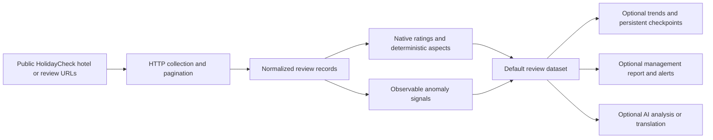

**Live Actor and maintained API: [Run HolidayCheck Review Intelligence on Apify](https://apify.com/kamerozkan/holidaycheck-review-intelligence)**

# HolidayCheck Review Intelligence Sample

[](https://apify.com/kamerozkan/holidaycheck-review-intelligence)
[](dataset_record.schema.json)
[](#source-boundaries)
[](LICENSE)

German-language hotel review data for DACH reputation, operations, and agency workflows. The Actor turns publicly available HolidayCheck review pages into structured ratings, source-reported verified-stay flags, deterministic aspect scores, observable anomaly signals, and optional management reports.

This is an unofficial, independent Actor. It is not affiliated with, endorsed by, or supported by HolidayCheck.

## Current verification

On September 30, 2026, the German management-report and competitor-benchmark inputs each completed on build `0.4.16`, returning 20 unique reviews with nonempty text and healthy collection status. Both generated German reports in JSON, HTML and plain text. The competitor example returned one set with five candidates; live prices and AI were disabled.

Release `0.4.17` changes only the Store README, retaining the same contracts. The German report input was checked again on this release: 20 unique reviews with nonempty text, healthy collection and a generated German report. See [release-verification.json](release-verification.json) and [verification-2026-09-30.json](verification-2026-09-30.json). These are owner tests of capped samples, not customer evidence, full hotel histories or proof that every optional feature works for every hotel. Trends from a new capped sample do not establish long-term changes.

The redacted review outputs below retain their original July 28 provenance from run `KHUAJkF5fVUqKtd75`, build `0.4.10`, dataset `9r8R4Ivo0xSeIrM75`. They have not been relabeled as September observations. [dataset_record.schema.json](dataset_record.schema.json) and [input.schema.json](input.schema.json) were refreshed from deployed source `0.4.16`.

## Public Store examples

Three example tasks are published:

| Use case | Published example | Input |
| --- | --- | --- |
| Review export | [Scrape reviews, ratings and aspects](https://apify.com/kamerozkan/holidaycheck-review-intelligence/examples/scrape-hotel-reviews-with-ratings) | [Original public input](01_public_store_example_input.json) |
| German reporting | [Create a German hotel review report](https://apify.com/kamerozkan/holidaycheck-review-intelligence/examples/create-a-german-hotel-review-report) | [Report input](04_german_management_report_input.json) |
| Competitor benchmark | [Compare a hotel with nearby competitors](https://apify.com/kamerozkan/holidaycheck-review-intelligence/examples/compare-a-hotel-with-nearby-competitors) | [Competitor input](05_competitor_benchmark_input.json) |

The two new starters use 20 reviews and separate named state stores. Duplicate a task into your own account, replace the hotel URL and choose the result and spending caps. Reports are in the run's key-value store as `MANAGEMENT_REPORT`, `MANAGEMENT_REPORT.html` and `MANAGEMENT_REPORT.txt`.

The repository also includes one historical owner-side saved Task input and a schema-valid monitoring recipe. These remain separately labeled.

## What the data supports

| Operational question | Evidence produced | Boundary |
| --- | --- | --- |
| What rating did the guest submit? | `overallRating`, normalized to the source 1-10 display scale | Does not independently verify the stay or reviewer |
| Which hotel areas receive positive or negative signals? | Eight deterministic `aspectScores` from native ratings and topic fields | Missing source signals remain unavailable |
| Is a review source-flagged as a verified reservation? | `verifiedReservation` | Reflects the source flag, not an independent audit |
| Are review patterns changing? | Monthly trends, rolling averages, and deltas when enabled | Requires comparable recurring samples |
| Is there an unusual observable pattern? | Burst, duplicate, rating-run, and writing metrics | Investigation hint only, never a fraud verdict |
| Can management consume the result without raw JSON? | Optional JSON, HTML, and text reports with alerts | Report quality depends on the collected sample |

## Pipeline



## Input examples

<details>
<summary><strong>01. Exact public Store Example</strong></summary>

```json
{
  "startUrls": [
    {
      "url": "https://www.holidaycheck.de/hr/bewertungen-pickalbatros-dana-beach-resort-hurghada/1aa4c4ad-f9ea-3367-a163-8a3a6884d450"
    }
  ],
  "collectionMode": "limit",
  "maxReviewsPerHotel": 60,
  "sort": "entrydate",
  "includeAspectScores": true,
  "includeAnomalySignals": true,
  "includeReviewerDetails": false,
  "includeManagementReport": true,
  "reportLanguage": "de"
}
```

[Open the complete exact Task input](01_public_store_example_input.json)

</details>

<details>
<summary><strong>02. Exact saved Task for negative-review triage</strong></summary>

```json
{
  "collectionMode": "limit",
  "maxReviewsPerHotel": 60,
  "sort": "negative",
  "includeAspectScores": true,
  "includeAnomalySignals": true,
  "includeManagementReport": true,
  "reportLanguage": "de"
}
```

This is exact saved Task `1YoBaKKh5YuzshYZE`. It is not currently a public Store Example.

[Open the complete exact saved Task input](02_negative_review_triage_saved_task_input.json)

</details>

<details>
<summary><strong>03. Schema-valid recurring monitoring recipe</strong></summary>

```json
{
  "collectionMode": "since",
  "cutoffDate": "2026-07-01",
  "sort": "entrydate",
  "resumeFromCheckpoint": true,
  "deduplicateAcrossRuns": true,
  "includeTrendIntelligence": true,
  "includeManagementReport": true
}
```

This is a repository recipe checked against the current input schema. It is not a saved or public Task.

[Open the complete monitoring recipe](03_since_monitoring_recipe_input.json)

</details>

## Verified and redacted outputs

All three records are based on dataset `9r8R4Ivo0xSeIrM75` from successful run `KHUAJkF5fVUqKtd75`. Review text, reviewer identity, owner-response text, and source quotes are omitted or redacted.

<details>
<summary><strong>Verified-stay flag with native aspect scores</strong></summary>

```json
{
  "reviewId": "1ca1c304-88a6-4d19-9eba-b2fdae7eb503",
  "overallRating": 8.2,
  "recommendation": true,
  "verifiedReservation": true,
  "aspectScores": {
    "room": {
      "score": 0.733,
      "label": "positive",
      "confidence": "high",
      "signalCount": 3
    }
  }
}
```

[Open the schema-valid redacted record](01_verified_review_output.json)

</details>

<details>
<summary><strong>Lower-rating row with mixed aspect evidence</strong></summary>

```json
{
  "reviewId": "ad9d7a34-a4c8-428e-a527-c8e2e69760e5",
  "overallRating": 5.5,
  "verifiedReservation": true,
  "aspectScores": {
    "room": {
      "score": -0.25,
      "label": "negative",
      "confidence": "medium"
    },
    "service": {
      "score": 1,
      "label": "positive",
      "confidence": "low"
    }
  }
}
```

[Open the schema-valid redacted record](02_low_rating_aspect_output.json)

</details>

<details>
<summary><strong>Elevated burst signal for human investigation</strong></summary>

```json
{
  "reviewId": "adbdd5b3-e748-4b04-83f1-13ef1838c341",
  "overallRating": 10,
  "verifiedReservation": false,
  "anomalySignals": {
    "burst": {
      "currentDayCount": 9,
      "baselineDays": 90,
      "zScore": 8.2,
      "status": "elevated"
    }
  }
}
```

This is an observable clustering signal, not evidence that a review is fake.

[Open the schema-valid redacted record](03_elevated_burst_signal_output.json)

</details>

## API quick start

```bash
curl -X POST \
  "https://api.apify.com/v2/acts/kamerozkan~holidaycheck-review-intelligence/runs" \
  -H "Authorization: Bearer YOUR_APIFY_TOKEN" \
  -H "Content-Type: application/json" \
  -d '{
    "startUrls": [
      {
        "url": "https://www.holidaycheck.de/hr/YOUR_HOTEL_ID"
      }
    ],
    "collectionMode": "limit",
    "maxReviewsPerHotel": 100,
    "includeReviewerDetails": false
  }'
```

## Collection modes

- `limit`: returns at most `maxReviewsPerHotel`, from 1 to 10,000 per hotel.
- `since`: requires `cutoffDate` in `YYYY-MM-DD` format and `sort: "entrydate"`.
- `all`: walks every review page currently exposed by the public interface.

`all` does not mean every review ever reported by the platform. HolidayCheck can report a larger total than the reviews exposed through public pagination.

## Source boundaries

- The Actor uses publicly accessible HolidayCheck pages and is not an official HolidayCheck API.
- It does not claim access to private, deleted, non-indexed, or non-pageable reviews.
- Source structure, accessibility, pagination, and fields can change.
- `verifiedReservation` reproduces a source-provided flag and is not independently verified.
- Anomaly metrics are observable patterns for investigation, not fake-review or fraud classifications.
- Reviewer details are disabled by default for data minimization.
- AI features require a separate OpenAI key, may incur separate charges, and were disabled in the verified run used here.
- Price intelligence is optional and may be unavailable. Comparisons are meaningful only for identical dates, occupancy, currency, offer type, and filters.
- Persistent checkpoints, seen IDs, trend state, and optional AI cache remain in the configured state store until managed or deleted.
- Users must confirm the lawful basis, permissions, retention, and permitted commercial use for their jurisdiction and source terms.

## Data contract

[dataset_record.schema.json](dataset_record.schema.json) is the current Actor dataset record contract. It covers normalized review identity, hotel metadata, ratings, source flags, aspects, optional AI or translation fields, anomaly signals, and source timestamps.

## Links

- [Live Actor](https://apify.com/kamerozkan/holidaycheck-review-intelligence)
- [Public Store Example](https://apify.com/kamerozkan/holidaycheck-review-intelligence/examples/scrape-hotel-reviews-with-ratings)
- [Apify API endpoint](https://api.apify.com/v2/acts/kamerozkan~holidaycheck-review-intelligence)
- [Kamer Ozkan on Apify](https://apify.com/kamerozkan)

## License

Repository files are available under the [MIT License](LICENSE). Source review content and third-party platform material remain subject to their respective rights and terms.
